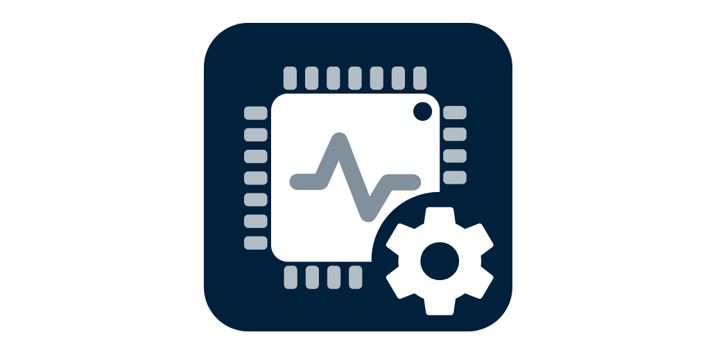

[](https://hub.docker.com/r/krillsson/sys-api)

Monitee agent (formerly sys-API) provide a [GraphQL API](https://graphql.org/) to your computers hardware.

It publishes and monitors values from [OSHI](https://github.com/oshi/oshi) with the help of [Spring](https://spring.io/). On Windows the information is supplemented with
[OpenHardwareMonitor](https://github.com/openhardwaremonitor/openhardwaremonitor) with a bit of help from [OhmJni4Net](https://github.com/Krillsson/ohmjni4net).

>This is the server backend for the Android app Monitee.
>
><a href="https://play.google.com/store/apps/details?id=com.krillsson.monitee"></a>

# [monitee.app/get-started](https://monitee.app/get-started/)

## What can it do?

Query for:
- CPU usage & info
- Memory usage
- List running processes
- List all network interfaces
- Show info from sensors and fans
- Motherboard information
- Manage docker containers
- Manage systemd services
- Manage windows services
- Read logs from files, systemd journal and Windows events 

### Monitoring

Currently, you can monitor

- CPU load
- CPU temperature
- Memory usage
- Network up
- Network upload/download rate
- Drive space
- Drive read/write rate
- Process ID CPU or Memory
- Docker container in running state
- Connectivity
- External IP changed

### GraphQL

GraphQL is available through the `/graphql` endpoint. Checkout the [schema](src/main/resources/). There's also a set of sample queries in the _sample-queries_ directory

A web-UI for trying out the GraphQL-API is also available at `<IP>:8080/graphiql`. If you don't want to expose this functionality. It can be disabled via the configuration.

```yaml
graphQLPlayGround:
  enabled: false
```

## Running

Referr to [monitee.app/get-started](https://monitee.app/get-started/) for how to run it on your system.

## Configuration
The application expects a user config file (_configuration.yml_) and a spring configuration file (_application.properties_) in the _/config_ directory.
See the sample files in the [/config](/config) repository directory.

### Self-signed certificates
By default, the Monitee agent will generate a self-signed certificate to enable HTTPS. This is to lower the barrier for encrypted traffic between the client and the server.
Please note that using properly signed certificates is better. Let's Encrypt is a free and good alternative.

For convenience, the certificates are persisted using a java keystore. If you wish to re-generate the certificates, delete the _keystorewww.jks_ file. But note that this will require re-adding the server in Monitee.

## Development
Setup
```sh
git clone [this repo] monitee-agent
```
```sh
./gradlew run
```

License
-------

    Licensed under the Apache License, Version 2.0 (the "License");
    you may not use this file except in compliance with the License.
    You may obtain a copy of the License at

       http://www.apache.org/licenses/LICENSE-2.0

    Unless required by applicable law or agreed to in writing, software
    distributed under the License is distributed on an "AS IS" BASIS,
    WITHOUT WARRANTIES OR CONDITIONS OF ANY KIND, either express or implied.
    See the License for the specific language governing permissions and
    limitations under the License.
