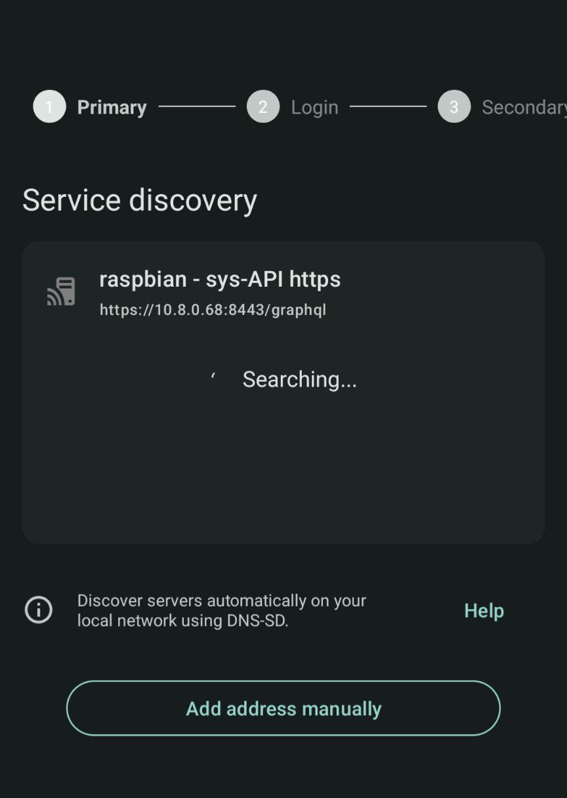
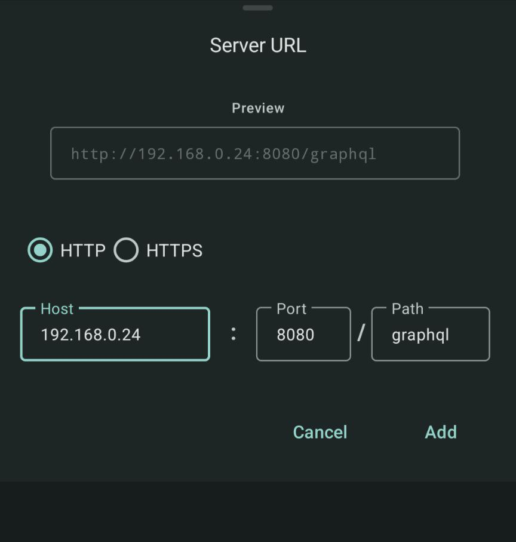
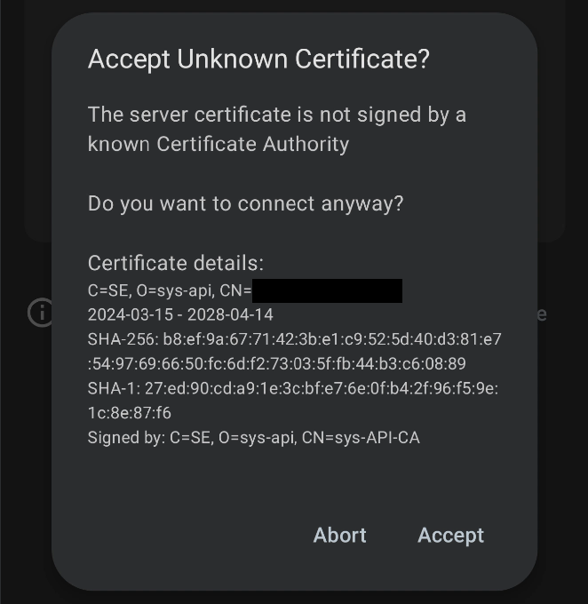
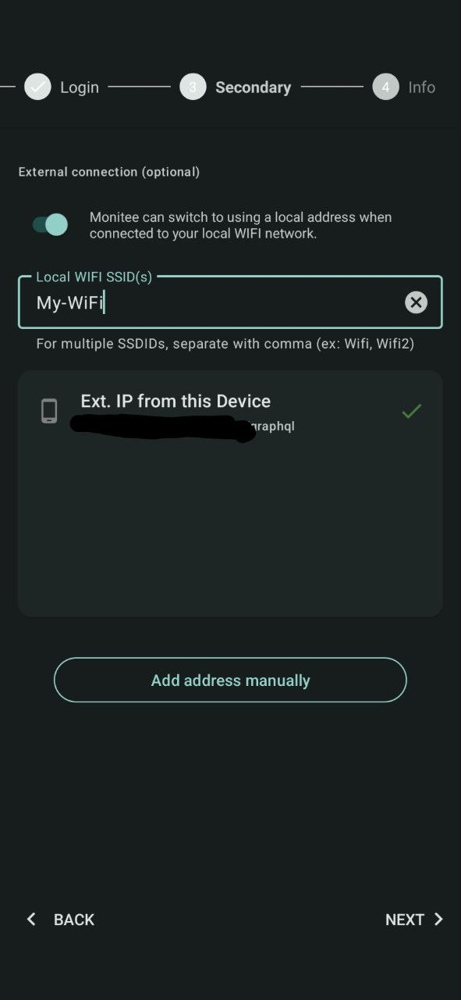
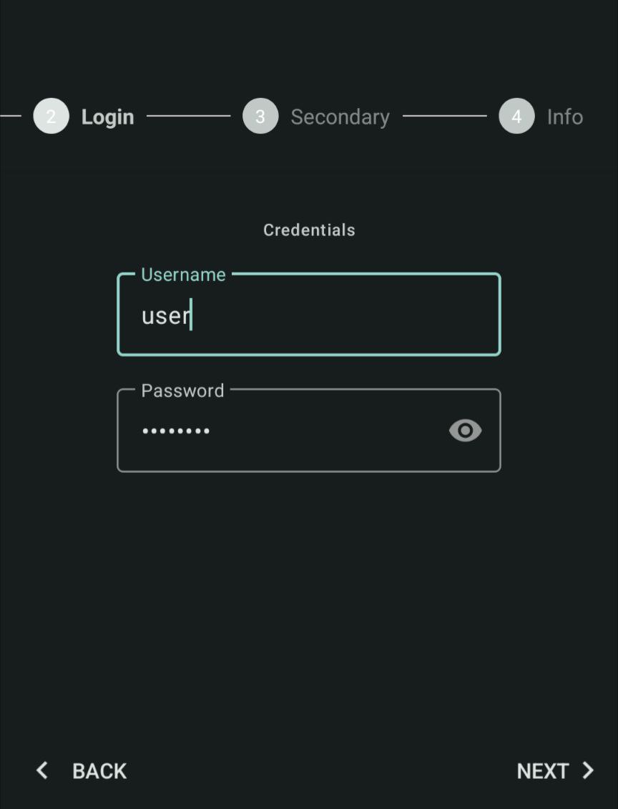
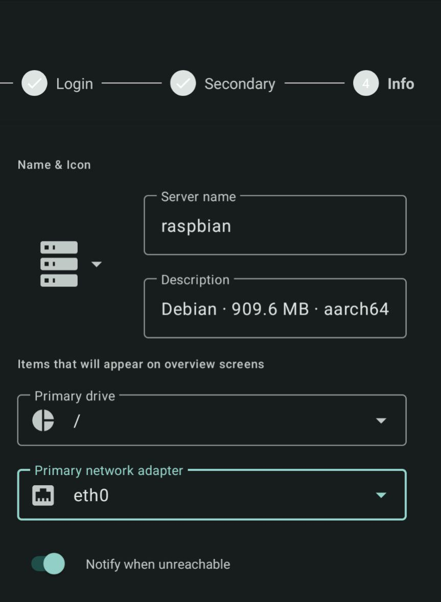
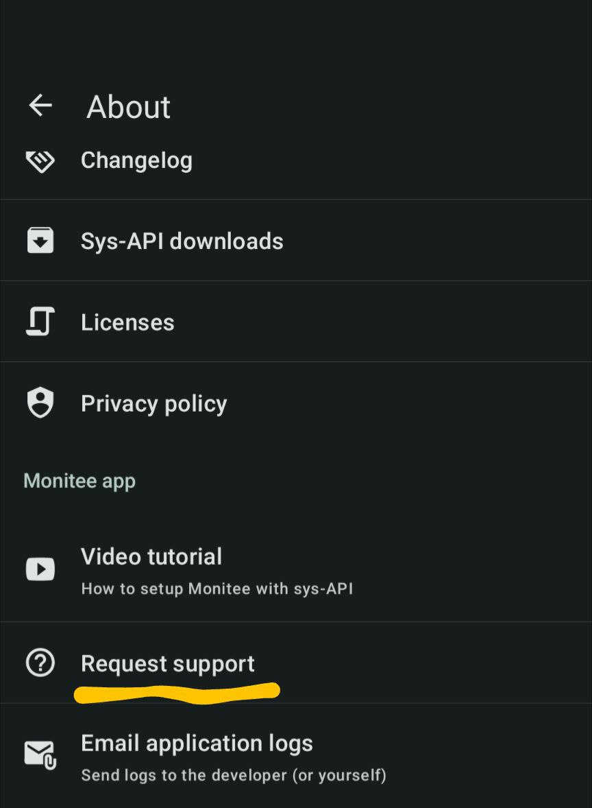

# Connect the app to your server

Got the Monitee agent running on your server? Let’s connect it to Monitee. The process is different depending on if the server is on your local network / WIFI or on the internet.

Please note, you connect the app directly to the server. There is no central server for service discovery or tunneling traffic. This is so that **you remain in control**.

##### Table of Contents

1. [Local only](#local-only)
2. [Self-signed certificate popup](#self-signed-certificate-popup)
3. [Internet only](#internet-only)
4. [Both Local and Internet](#both-local-and-internet)
5. [Login step](#login-step)
6. [Info step](#info-step)
7. [Final words…](#final-words)

## Local only

Monitee agent has a feature to broadcast itself on your local network using [DNS-SD](https://en.wikipedia.org/wiki/Multicast_DNS). It works with most routers, but not all. If it is working, the server will show up on the Service Discovery page in Monitee.

If it shows up, just select it and press **Next**

However, if the server does not show up. Press the **Add address manually button**



In the dialog that appears, fill in the servers local IP.

To find the local IP of the server use this command.

```bash
ifconfig
```

Look for the IP of the eth0 or wlan0 interface.



## Self-signed certificate popup

If you choose to connect over HTTPS and have not done anything to configure SSL for the service, it will use a self-signed certificate per default. A popup will appear for you to review the contents and trust the certificate.

[Can’t get SSL to work?](ssl-troubleshooting.md)



## Internet only

There’s a few prerequisites to get this working

- You need to have a publicly available static IP or domain.
  - Find your public IP here: [https://ifconfig.me/](https://ifconfig.me/)
  - Make sure you are not behind [CG-NAT](https://en.wikipedia.org/wiki/Carrier-grade_NAT). If you are, you can use [Tailscale](https://tailscale.com/use-cases/homelab/).
- Port 8443 or 8080 need to be open in your router and firewall
  - [How to open port in router](https://portforward.com/router.htm)
  - [How to open a port in Linux](https://www.digitalocean.com/community/tutorials/opening-a-port-on-linux)
- HTTPS is recommended, for your privacy.

Server discovery does not work over the internet. Press the **Add address manually button** in the Primary step


In the dialog that appears, fill in the servers public IP or domain.

To find the public IP of the server use this command.

```bash
curl ifconfig.me
```


## Both Local and Internet

For when the server is on your local network, but you would like to access it over the internet as well.

Make sure all prerequisites from previous steps are working

Fill in the servers **Local IP** in the Primary step

In the Secondary step. Fill in the servers public IP.

*Monitee will fetch the public IP from your phones perspective. If you are currently on the same WIFI network as the server, you can use the* ***“Ext. IP from this Device”*** option.

However, if you are not on the same WIFI. Press the **Add address manually button**



## Login step

Fill in the username and password you entered in the [configuration.yml](https://github.com/Krillsson/monitee-agent/blob/master/config/configuration.yml) when setting up Monitee agent.



## Info step

This is your chance to customize your server a bit. Give it a descriptive name and icon

Select what drive and network adapter you want to appear on the server detail dashboard

Choose ***“Notify when unreachable”*** if you’d like Monitee to send you a notification when it can’t reach the server. Note that this doesn’t make sense if you use the Local server only option, since you will receive notifications when you are not on the same WIFI as the server.



## Final words…

That’s it! You should be setup by now. Should you run into any issue. Don’t hesitate to reach out via the ***“Request Support”*** in-app option.

Reach it from the Settings > About screen.


