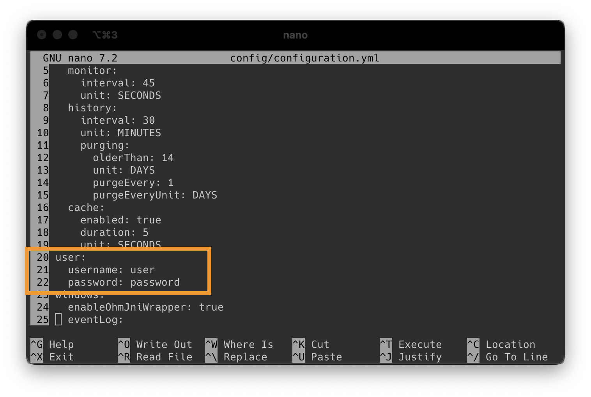

# Deb package

## For Debian based Linux distros (e.g Ubuntu / Raspbian)

Log onto your server

First, let’s make sure the server has java installed

```bash
java -version
```

**The version need to be at least java 21**

Does it say “**-bash: java: command not found**“?

```bash
sudo apt-get install openjdk-21-jre-headless
```

This will install openjdk version 21. But there are lots of alternatives available. [SDKMAN](https://sdkman.io/install) is a great tool to install and manage java versions.

Now that we have java, let’s continue

Let’s also check if we have the deamon package installed

```bash
which daemon
```

If the output gives you a location (like /usr/bin/daemon), then you are good.

Otherwise do:

```bash
sudo apt-get install daemon
```

To allow monitee agent monitor temperature of disks, we need smartmontools

```bash
sudo apt-get install smartmontools
```

Then go to [GitHub](https://github.com/Krillsson/sys-api/releases/latest)  in a browser to find latest release download

Copy the URL of the file *sysapi_x.x.x_all.deb*

Then you can download that on your server

**Remember to change x.x.x to the actual version when copy pasting**

```bash
wget https://github.com/Krillsson/sys-API/releases/download/x.x.x/sysapi_x.x.x_all.deb
```

Then we need to install it using apt. Making sure we use the ./ syntax so apt knows its a file and not a package

```bash
sudo apt install ./sysapi_x.x.x_all.deb
```

Use your favorite text editor to edit the user & password of the config

```bash
nano /opt/sys-api/config/configuration.yml
```



Then press **CTRL+X** to exit nano (and press **Y** to save)

If you need to change the default application ports 8080 and 8443, you can do so in the */opt/sys-api/config/application.properties* file

Now we can start sys-api using systemctl

```bash
systemctl start sys-api
```

We can also check its status

```bash
systemctl status sys-api
```

And using journalctl we can read the log output

```bash
journalctl -u sys-api.service
```

When you see the following, we know that the server is up and running:

```bash
[...]: Tomcat started on ports 8443 (https), 8080 (http) with context path '/'
[...]: Started SysAPIApplicationKt in 6.352 seconds (process running for 7.234)
```

Now you are ready to proceed to next step

[Connect App to Server](connect-app-to-server.md)
