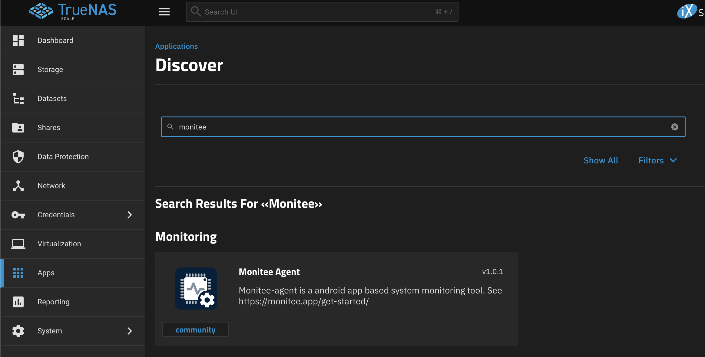
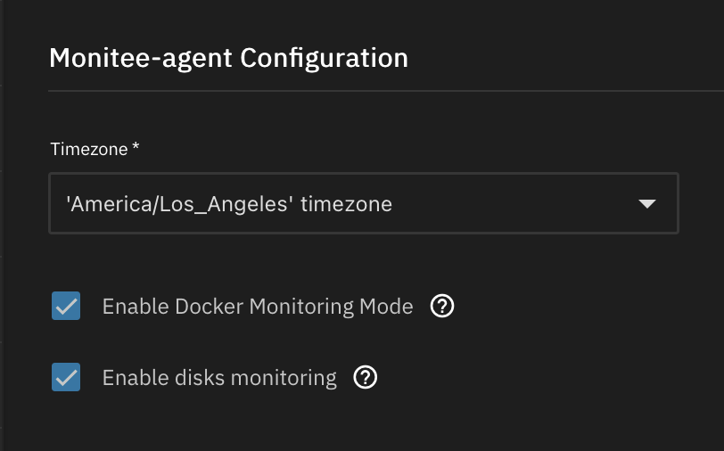
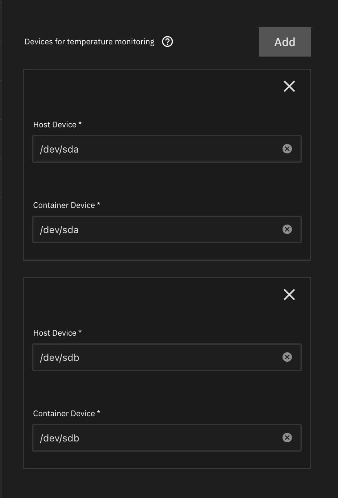
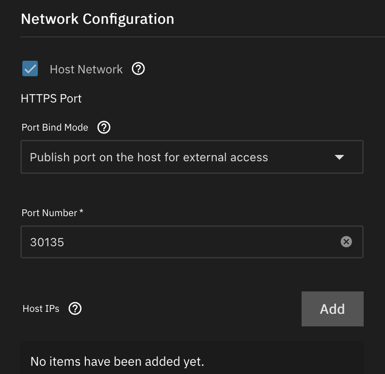
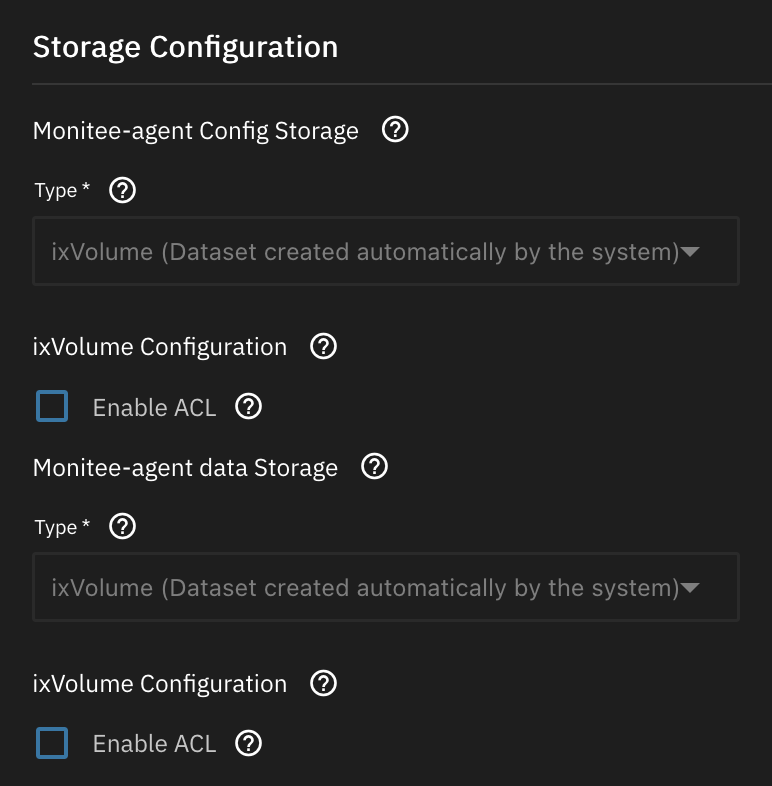
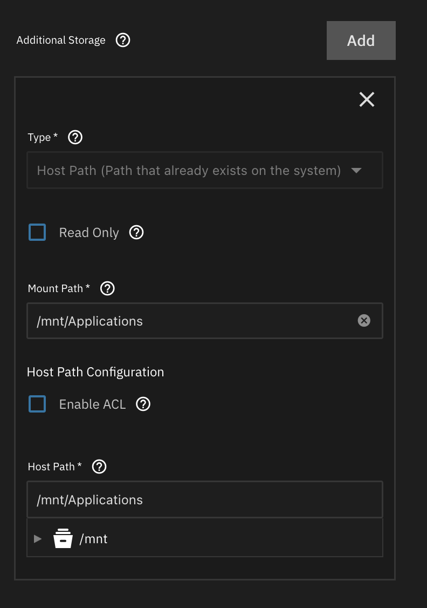

# TrueNAS Scale

## Find the community app

Search for monitee in community applications. It can also be found under the Monitoring category.



## Choose what you want to expose to the container

- **Docker monitoring mode:** exposes the docker socket on your machine for monitee-agent, so you can manage docker containers from the app.
- **Disks monitoring:** exposes the /dev directory and udev information so that monitee agent can read disk statistics



### Disk devices for SMART monitoring

The container need device level access to be able to read SMART data using [smartmontools](https://www.smartmontools.org/). Add the disk devices you’d like to monitor here.



## Network configuration

Specify what ports you’d like monitee-agent to bind to.

It’s recommended to leave Host Network option enabled. Without it, you won’t be able to see network statistics in the app.



## Storage configuration

Storage for the */data* and */config* directory is standard procedure. You can leave it as is or configure it to your liking.



In the additional storage section, add host path bindings for the datasets you’d like to monitor storage usage for. Here I have added the Applications dataset.



## Change configuration

Start the container and wait until it has come up. Monitee agent will write default configuration files to the /config directory.

Use the TrueNAS shell to go to the config directory. Assuming you used the ix volumes option:

```bash
cd /mnt/.ix-apps/app_mounts/monitee-agent/config
```

Use nano to change the default username/password:

```bash
nano configuration.yml
```

```yaml
#########################################
### sys-API user configuration        ###
#########################################
#
# Line 20 
user: 
  username: user # <--- CHANGE ME
  password: password  # <--- AND ME
```

Press **CTRL+X** to exit nano (and press **Y** to save)

Restart the container

We can verify that the server is working by looking at the logs in the TrueNAS UI.

```bash
[...]: Tomcat started on ports 3036 (https), 3035 (http) with context path '/'
[...]: Started SysAPIApplicationKt in 6.352 seconds (process running for 7.234)
```

Now you are ready to proceed to next step

[Connect App to Server](connect-app-to-server.md)
